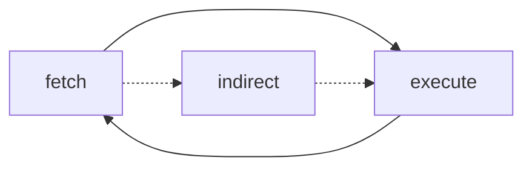

# Computer Architecture

  

    Table of contents
  

  {: .text-delta }
- . TOC
{:toc}

As the concurrent programming needs deep understanding in processes and threads, we first talk about the computer architecture briefly.

## Big Picture of Computer Architecture

Here's a big picture of the computer design detailed on the CPU.

In the picture, It contains a mainboard (mother board) that includes 1 CPU (2 Core, 4 Hardware threads) architectures and memoy, and system bus that can link I/O and subsidiary memory (Disk).

## Central Processing Unit (CPU)

The Central Processing Unit (CPU) is the computational core of a computer system, which is responsible for executing instructions and processing data.

The CPU comprises several fundamental functional units: arithmetic logic unit(ALU), control unit (CU), registers and caches.

### Arithmetic Logic Unit (ALU)

The Arithmetic Logic Unit (ALU) performs arithmetic operations such as addition and subtraction, and also logical operations like AND, OR, and XOR on binary data. 

### Control Unit (CU)

The Control Unit (CU) acts as the command center, which manages and coordinates the execution of instructions by providing the necessary timing by clock and control signals to other units/memory/devices.

CU is a vital component of the CPU that directs the operation of the processor. Its primary function is to manage and coordinate the activities of all other hardware components within the computer system by fetching, decoding, and executing instructions. The CU instructs the memory, logic unit (ALU), and I/O devices on how to respond to the program's instructions (to be specifically, it uses I/O controller). It fetches internal program instructions from the main memory to the processor instruction register and generates control signals based on the contents of this register to supervise the execution of these instructions. The CU essentially orchestrates the entire process of instruction execution, ensuring that instructions are carried out in the proper sequence and with the right data.   

CU comprises several key components. The Instruction Register holds the current instruction being decoded. A Decoder within the CU interprets the opcode of the instruction to determine the required operation. The Control Signal Generator then produces the necessary electrical signals to control other units like the ALU and memory based on the decoded instruction. The Program Counter and Memory Address Register (already discussed) are also integral to the CU's operation in fetching instructions and data. In microprogrammed control units, a Microprogram Sequencer determines the sequence of microinstructions to be executed for each machine instruction, often using a Control Store which is a memory that holds these microinstructions. A Clock provides timing signals to synchronize the various operations within the CPU. Additionally, Input Flags from other parts of the CPU or system can influence the control flow managed by the CU.   

The CU operates by first fetching an instruction from memory using the address in the PC, which is then placed in the MAR. The instruction is retrieved and loaded into the IR. The decoder then interprets the instruction's opcode. Based on this decoded instruction, the control signal generator produces a series of control signals that direct the activities of other CPU components, such as the ALU performing calculations or data being read from or written to memory.   

There are two main types of Control Units: Hardwired and Microprogrammed. Hardwired control units use specially designed hardware logic circuits to generate control signals, resulting in faster execution but less flexibility for modifying the instruction set. Microprogrammed control units, on the other hand, use a control store memory to hold microinstructions, which are then executed to implement machine instructions, offering more flexibility but potentially with a slight performance overhead. CU is essential for the correct execution of programs, ensuring that instructions are carried out in the proper sequence and with the right data. It is often considered the brain of the CPU, orchestrating all operations within the computer system.   

### Registers
Registers are foremost high-speed storage within the CPU, used for temporary data and instructions that are being processe. 

| **Register**                                | **Purpose**                                                                                                                     | **Functionality**                                                                                                                                                                                                                                                                                                                                                                                             |
|---------------------------------------------|---------------------------------------------------------------------------------------------------------------------------------|------------------------------------------------------------------------------------------------------------------------------------------------------------------------------------------------------------------------------------------------------------------------------------------------------------------------------------|
| **Program Counter (PC)**                    | Holds the memory address of the next instruction.                                                                               | Ensures sequential instruction execution. Can be modified by branching, function calls, or interrupts. Plays a key role in context switching in multitasking systems.                                                                                                                                                                                                 |
| **Instruction Register (IR)**               | Stores the current instruction being executed or decoded.                                                                       | Holds the instruction fetched from memory for quick access. Provides the instruction to the control unit for decoding. In pipelined processors, multiple IRs handle different instruction stages.                                                                                                                                                                      |
| **Memory Address Register (MAR)**           | Holds the memory address for data or instructions to be accessed.                                                               | Acts as a pointer to memory locations for read/write operations. Enables memory isolation by restricting access to allocated spaces. Works closely with the MBR for memory operations.                                                                                                                                                                                |
| **Memory Buffer Register (MBR) / Memory Data Register (MDR)** | Temporarily holds data being transferred between the CPU and memory.                                              | Acts as a buffer during memory read/write operations. Enables independent operation of CPU and memory. Works alongside the MAR to facilitate memory access.                                                                                                                                                                                                            |
| **Flag Register (FR)**                      | Contains status flags representing CPU operation outcomes.                                                                     | Flags include Zero, Carry, Sign, Parity, Auxiliary Carry, etc. Supports conditional branching and error detection. Behavior varies by CPU architecture.                                                                                                                                                                                                                |
| **General Purpose Registers (GPRs)**        | Stores data for arithmetic, logic, and memory operations.                                                                       | Versatile storage for operands, addresses, or intermediate results. Examples include AX, BX, CX, DX, SP, BP, SI, DI. Optimizes performance by reducing memory access.                                                                                                                                                                                                |
| **Stack Pointer (SP)**                      | Holds the address of the top of the stack.                                                                                      | Manages function calls, local variables, and return addresses. Follows LIFO (Last-In, First-Out) principle. Enables nested function calls.                                                                                                                                                                                                                            |
| **Base Register**                           | Holds a base address for dynamic memory access.                                                                                 | Supports base and indexed addressing modes. Facilitates dynamic memory management and access to data structures. Crucial for operating system memory management.                                                                                                                                                                                                      |

## Instruction Cycle and Interrupt

### Instruction Cycle
The instruction cycle, also known as the fetch-execute cycle, is the fundamental operational process of a computer's CPU. This cycle is repeated continuously from the moment the computer boots up until it is shut down, processing one instruction at a time (though modern CPUs overlap this process). The instruction cycle typically consists of two main stages: the fetch stage, and the execute stage. (Some books contains the indirect cycle)

#### Fetch Cycle

The Fetch Cycle is the initial stage where the CPU retrieves the next instruction from the main memory. The address of the next instruction is held in the Program Counter (PC). This address is transferred to the Memory Address Register (MAR). The CPU then initiates a memory read operation using the address bus, and the instruction is fetched from memory and placed on the data bus. The instruction is then copied into the Memory Data Register (MDR). Subsequently, the instruction is moved from the MDR to the Instruction Register (IR). Finally, the Program Counter is incremented to point to the next instruction in memory, preparing for the next cycle.   

#### Execution Cycle

The Execution Cycle is where the CPU performs the operation specified by the instruction that is now held in the Instruction Register (IR). The Control Unit (CU) interprets the instruction in the IR and sends control signals to the appropriate functional units within the CPU, such as the Arithmetic Logic Unit (ALU) or the Floating-Point Unit (FPU), to carry out the required actions. This might involve reading operands from registers, performing arithmetic or logical operations, and storing the result back into a register or memory.   

#### Indirect Cycle

The Indirect Cycle is an additional step that occurs before the execution cycle if the instruction uses indirect addressing. In indirect addressing, the address field of the instruction does not contain the actual address of the operand. Instead, it contains the address of a memory location that holds the effective address of the operand. During the indirect cycle, the CPU first fetches the address of the operand from the memory location specified in the instruction. This address is then used in a subsequent memory access (during the execution cycle) to retrieve the actual operand. This highlights the flexibility of addressing modes, allowing instructions to access data in memory through pointers rather than direct addresses.   

To enhance performance, modern CPUs often employ pipelining, a technique that overlaps the execution of multiple instructions. By dividing the instruction cycle into several stages (e.g., fetch, decode, execute, memory access, write back), the CPU can start processing the next instruction before the previous one has fully completed all stages. This allows multiple instructions to be in different stages of execution simultaneously, significantly increasing the throughput of the CPU. The instruction cycle is the fundamental rhythm of the CPU's operation, and understanding its stages is crucial for comprehending how software instructions are translated into hardware actions.

### Interrupt

Interrupts are signals that cause the CPU to temporarily suspend its current task and handle a specific event. They are essential for making computer systems responsive to both internal errors and external events, allowing the CPU to handle these situations promptly without constantly polling for them, which would be inefficient. Interrupts can be broadly classified into two categories based on their source: synchronous interrupts (program exceptions) and asynchronous interrupts (hardware interrupts).   

Synchronous Interrupts, often referred to as program exceptions, are generated by the CPU itself during the execution of an instruction. These typically occur due to an error condition detected by the processor. Examples of synchronous interrupts include division by zero (when an attempt is made to divide a number by zero), illegal instruction (when the CPU encounters an instruction it does not recognize), memory access violation (such as a segmentation fault, when a program tries to access memory it is not authorized to access), and system calls (when a program requests a service from the operating system). Synchronous interrupts are predictable; they will occur at the same point every time the same instruction is executed under the same program state.   

Asynchronous Interrupts, also known as hardware interrupts, are generated by external hardware devices to signal an event that needs the CPU's attention. These interrupts are triggered by events that are external to the currently executing instruction and are often unpredictable in their timing. Common examples of asynchronous interrupts include a keyboard press (signaling that the user has typed something), mouse movement, a network card receiving data, a disk I/O operation completing (e.g., data has been read from the hard drive), and timer interrupts (generated by a hardware timer at regular intervals). Asynchronous interrupts are crucial for allowing the CPU to respond to events happening in the external environment in a timely manner.   

The key distinguishing characteristic between these two types of interrupts is their source and predictability. Synchronous interrupts are internally generated and occur predictably in relation to the executing instruction, while asynchronous interrupts originate from external devices and occur unpredictably. The handling of interrupts involves saving the current state of the CPU (including the Program Counter and registers) so that the interrupted program can resume execution after the interrupt service routine (ISR) has completed. This process of context switching is a fundamental concept in operating systems and concurrent programming.   

## Conclusion
Of course, we didn't cover all the computer architecture, actually we just covered very small but essential part of computer architecture to only understanding the CPU. We didn't cover the memory addressing, Instruction pipeline, CISC / RISC paradigms in CPU designs, memory, I/O and so on. Some of them are actually deeply related to deep understanding of the concurrent programming, but I will left those fancinating subjects to you. 