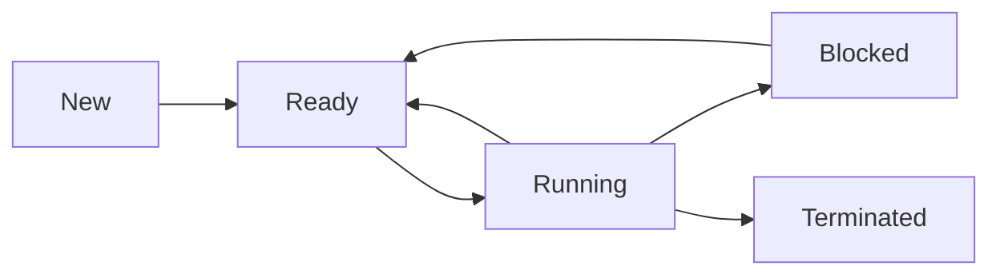

# Process

A process is a program in execution. It means it has not only a space aspect (a program) but also time aspect (in execution)

  

    Table of contents
  

  {: .text-delta }
- . TOC
{:toc}

## More specifically

A process's space is the allocated memory. This memory includes the code of the program, the data using for the program, and the stack. Here, the stack is used to store the state of the process, such as the values of the registers and the program counter

In terms of time aspect, the time includes the process **waiting** time for its running, process **running** time, and its **waiting I/O** time.

These aspects of a process are closely related. the allocated memory of a process determines how long the process can run. vice versa.

## What are in a Process

1. Process ID (PID)
2. Process State
3. Executable (Binary)
4. Files
5. Address space
6. Registers
7. Stack
8. Heap
9. Data Segment
10. Process Control Block (PCB)

> **PCB**    
> PCB is a data structure maintained by the OS that stores all the information about a process (including all the items listed above).  The PCB is how the OS manages and keeps track of processes.

## States of a Process

A process is genrally created and controlled by the OS.

## Multiple Processes

A process can create its child processes through OS system call. This creating is called spawning.

- fork() (Unix-like): Creates a new process that is a copy of the parent process. The child process gets its own copy of the parent's address space (initially).

- spawn() (Windows): Creates a new process, but the way it's done is different from fork(). It's generally more efficient than fork() on Windows, but the child process doesn't inherit the parent's memory in the same way.

Child processes are independent forks of the main process. Each child process isolated in terms of memory address space.

As operating system controls this isolation, a direct access of instructions and data among the processes is not allowed.