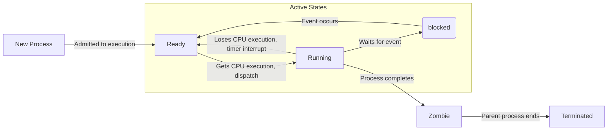

# Multiprocessing

Multiprocessing is technique of executing multiple processes concurrently.  

A **process** is a program in execution. A process is not just a program (space aspect) but also an instance of execution (time aspect).

<details open markdown="block">
  <summary>
    Table of contents
  </summary>
  {: .text-delta }
- . TOC
{:toc}
</details>

## More on Processes

A process's space is the allocated memory. This memory includes the code of the program, the data using for the program, and the stack. Here, the stack is used to store the state of the process, such as the values of the registers (ex. program counter)

In terms of time aspect, the time includes the process **waiting** time for its running, process **running** time, and its **waiting I/O** time.

These aspects of a process are closely related. The allocated memory of a process influences its execution time, and vice versa.

## Memory space in Process

1. Stack
2. Heap
3. Data Segment
4. Code
5. Process Control Block (PCB - In kernel)
    1. Process ID (PID)
    2. Register Values
    3. Process State
    4. CPU Schedule Information
    5. Memory Information (Base-register, limit-register and page table)


## States of a Process

A process is generally created and controlled by the OS.



## How Multiple Processes Work?

A process can create child processes through OS system calls, this is known as spawning.

- fork() (Unix-like): Creates a new process that is a copy of the parent process. The child process gets its own copy of the parent's address space (initially).

- spawn() (Windows): Creates a new process, but the way it's done is different from fork(). It's generally more efficient than fork() on Windows, but the child process doesn't inherit the parent's memory in the same way.

Child processes are independent forks of the main process. Each child process isolated in terms of memory address space.

As operating system controls this isolation, a direct access of instructions and data among the processes is not allowed.

### Other POSIX Process system calls

 - fork()
 - execve()
 - exit()
 - waitpid()

`execve()` is a system call that also makes a new process, however, it actually replace the process on the current process.
`exit()` is a system call for exitting process.
`waitpid()` is a system call for waiting the termination of children's process.


## Examples of Multiprocessing
Here are naive examples in Python and C++.

### Multiprocessing in python
In Python, by using `multiprocessing` library, we can achieve the multiprocessing.

```python
import os
import time
from multiprocessing import Process

def run_child(cpu_waste_seconds:int) -> None:
    time.sleep(cpu_waste_seconds)
    curr_pid = os.getpid()
    print(f"child ({curr_pid}) : finished job")


def run_parent(num_children:int=3, cpu_waste_seconds:int=2) -> None:
    curr_pid = os.getpid()

    child_processes = [
        Process(target=run_child, args=(cpu_waste_seconds,))
        for _ in range(num_children)
    ]

    for child_process in child_processes:
        child_process.start()

    for child_process in child_processes:
        child_process.join()

    print(f"parent's ({curr_pid}) : finished job")

if __name__ == "__main__":
    num_children       : int = 3
    child_process_time : int = 2
    run_parent(num_children=num_children, cpu_waste_seconds=child_process_time)
```

### Multiprocessing in C++
In C++, unlike multithreading, there is no standard library that interfaces multiprocessing, in other words, you should write multiprocessing calls that depend on the target OS.


Here's an example of naive multiprocessing in UNIX-like OS environment.
```cpp
#include <iostream>
#include <chrono>

//UNIX dependency (POSIX). Not compatible with Windows.
#include <unistd.h>

#include <sys/types.h>
#include <sys/wait.h>
#include <thread> // to use thread - sleep

void SleepFor(int sleepSeconds)
{
    auto sleepLiteral = std::chrono::seconds(sleepSeconds);
    std::this_thread::sleep_for(sleepLiteral);
}

void RunChild(int sleepSeconds) {
    pid_t currPID = getpid();
    SleepFor(sleepSeconds);
    std::cout << "Child process PID: " << currPID << std::endl;
}

void RunParent(int numChildren = 3, int sleepSeconds = 2) {
    pid_t currPID = getpid();
    std::cout << "Parent process PID: " << currPID << std::endl;

    for (int i = 0; i < numChildren; ++i) {
        pid_t PID = fork();
        
        if (PID < 0) {
            std::cerr << "Fork failed" << std::endl;
        } else if (PID == 0) {
            RunChild(sleepSeconds);
            _exit(0); // Terminate child process
        }
    }
    
    // Parent waits for all children to finish
    for (int i = 0; i < numChildren; ++i) {
        waitpid(-1, nullptr, 0);
    }
}

int main() {
    const int NUM_CHILDREN  = 3;
    const int SLEEP_SECONDS = 2;
    RunParent(NUM_CHILDREN, SLEEP_SECONDS);
    return 0;
}
```

## Conclusion

Processes are fundamental to concurrent programming, providing independent execution environments that enable efficient multitasking. Processes do not share memory directly, ensuring greater isolation and stability but at the cost of increased communication overhead.

Multiprocessing allows programs to leverage multiple CPU cores, making it ideal for CPU-bound tasks. However, inter-process communication (IPC, which will be discussed in the future) mechanisms such as pipes, shared memory, and message queues are required for data exchange between processes.

While Python's multiprocessing module provides a high-level abstraction for spawning and managing processes, C++ requires explicit system calls like fork() (Unix) or spawn() (Windows). Each approach comes with its own trade-offs in terms of portability, efficiency, and complexity.