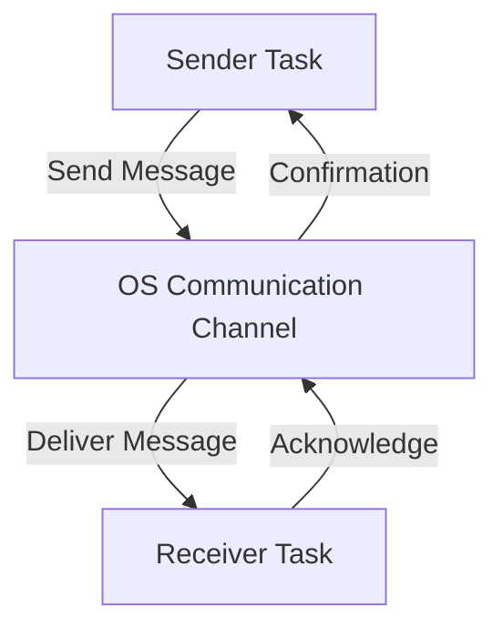

# Message-Passing IPC

Message-passing IPC provides a structured way for tasks to communicate without directly sharing memory. It is widely used in distributed systems and multiprocessing environments where isolation between processes is crucial.

In message-passing IPC, each task is identified by a unique name, and tasks interact by sending and receiving messages to and from named tasks.

The OS establishes a communication channel and provides proper system calls for tasks to pass messages through this channel.

The advantage of Message-Passing is that the OS manages the channel, providing a useful interface to send and receive data without conflict. However, there is a huge communication cost. To transfer any piece of information between tasks, information must be copied from the task's user space to the OS channel through system calls and then copied back to the address space of the receiving task.

## Pipe

Pipes provide a unidirectional communication channel between processes. They are commonly used for parent-child process communication and allow data transfer in a sequential manner.

## Message Queue

Message queues allow multiple processes to exchange discrete messages asynchronously. This mechanism ensures structured communication and enables better decoupling of process execution.

## Socket

Sockets provide communication between processes over a network or within the same machine. They support both connection-oriented (TCP) and connectionless (UDP) communication models, making them suitable for distributed systems.

## Conclusion

Inter-Process Communication (IPC) is fundamental to concurrent programming, allowing processes and threads to coordinate efficiently. Choosing the right IPC mechanism depends on factors such as performance requirements, data-sharing needs, and synchronization complexity. While shared memory offers high-speed access, message-passing techniques provide better isolation and modularity, making them suitable for different use cases in multi-threaded and multiprocessing environments.

