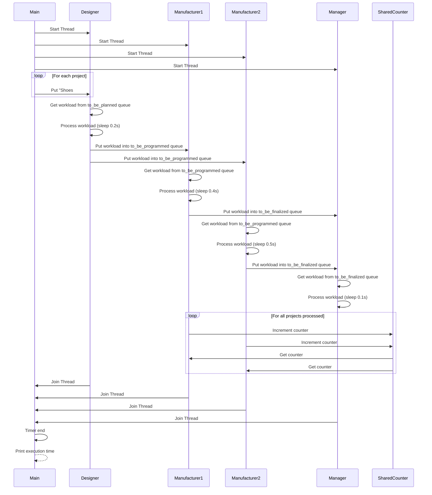

# Task Decomposition

As in the metaphor (Designer, Manufacturer and Manager), we can describe the task decomposition is way to hire the workers into designing / manufacturing and managing and work concurrently as possible.

<details open markdown="block">
  <summary>
    Table of contents
  </summary>
  {: .text-delta }
- . TOC
{:toc}
</details>


## Pipeline Pattern

Pipeline pattern is the most common in task decomposition.

We design the steps be in different resources (thread / processes ) and then control the internal outputs/artifacts between the steps by IPC or thread-safe queues, because the steps are usually not finished at the same time.

### Dependency Graph Example




### Python Example

```python
import time
import threading
from queue import Queue
import typing as T
from utils import Timer

Workload = T.AnyStr

class SharedCounter:
    def __init__(self, initial_value:int = 0):
        self._value = initial_value
        self._mutex = threading.Lock()
    def increment(self):
        with self._mutex:
            self._value += 1
    def decrement(self):
        with self._mutex:
            self._value -= 1
    def get(self):
        with self._mutex:
            return self._value

class Worker(threading.Thread):
    def __init__(
        self,
        in_queue: Queue[Workload],
        out_queue: T.Optional[Queue[Workload]],
        job_type: str,
        turnaround_time: int = 4,
        num_projects: int = 4,  # Ensure workers know the number of projects
        process_counter: T.Optional[SharedCounter] = None
    ):
        super().__init__()
        self.in_queue = in_queue
        self.out_queue = out_queue
        self.job_type = job_type
        self.turnaround_time = turnaround_time
        self.num_projects = num_projects
        if process_counter:
            self.process_counter = process_counter
        else:
            self.process_counter = SharedCounter(initial_value=0)

    def run(self) -> None:
        while self.process_counter.get() < self.num_projects:
            try:
                workload = self.in_queue.get(timeout=1)  # Avoid infinite blocking
            except Exception:
                continue  # Keep checking if no task available

            if workload is None:
                self.in_queue.task_done()
                break  # Stop if sentinel received

            print(f"{self.job_type} .... {workload}")
            time.sleep(self.turnaround_time)
            self.process_counter.increment()

            if self.out_queue:
                self.out_queue.put(workload)

            self.in_queue.task_done()

class Pipeline:
    def __init__(self, num_projects: int = 4):
        self.num_projects = num_projects

    def assemble_leathers(self) -> Queue[Workload]:
        projects_in: Queue[Workload] = Queue()
        for idx in range(self.num_projects):
            projects_in.put(f"Shoes #{idx}")
        return projects_in

    def run_concurrently(self) -> None:
        to_be_planned = self.assemble_leathers()
        to_be_programmed = Queue()
        to_be_finalized = Queue()

        designer = Worker(to_be_planned, to_be_programmed, "Designer", turnaround_time=0.2, num_projects=self.num_projects)

        # Assume that data decomposition. we hired multiple manufacturers.
        shared_counter = SharedCounter(initial_value=0) # use as an atomic value in C++
        # suppose that manufacturer1 is more skillful than manufacturer2 
        manufacturer1 = Worker(to_be_programmed, to_be_finalized, "Manufacturer 1", turnaround_time=0.4, num_projects=self.num_projects, process_counter=shared_counter)
        manufacturer2 = Worker(to_be_programmed, to_be_finalized, "Manufacturer 2", turnaround_time=0.5, num_projects=self.num_projects, process_counter=shared_counter)

        manager = Worker(to_be_finalized, None, "Manager", turnaround_time=0.1, num_projects=self.num_projects)

        designer.start()
        manufacturer1.start()
        manufacturer2.start()
        manager.start()

        # Wait for all tasks to be processed
        designer.join()
        manufacturer1.join()
        manufacturer2.join()
        manager.join()


if __name__ == "__main__":
    with Timer() as timer:
        pipeline = Pipeline(num_projects=100)
        pipeline.run_concurrently()

```


### C++ Example

```cpp
#include <iostream>
#include <queue>
#include <mutex>
#include <condition_variable>
#include <thread>
#include <memory>
#include <chrono>
#include <string>

template<typename T>
class ThreadSafeQueue {
public:
    void Push(T item) {
        std::lock_guard<std::mutex> lock(m_Mutex);
        m_Queue.push(std::move(item));
        m_CV.notify_one();
    }
    
    bool Pop(T& item, std::chrono::milliseconds timeout) {
        std::unique_lock<std::mutex> lock(m_Mutex);
        if (m_CV.wait_for(lock, timeout, [this] { return !m_Queue.empty(); })) {
            item = std::move(m_Queue.front());
            m_Queue.pop();
            return true;
        }
        return false;
    }
private:
    std::queue<T> m_Queue;
    mutable std::mutex m_Mutex;
    std::condition_variable m_CV;
};

class SharedCounter {
public:
    SharedCounter(int initialValue = 0) : m_Value(initialValue) {}
    void Increment() {
        std::lock_guard<std::mutex> lock(m_Mutex);
        ++m_Value;
    }
    void Decrement() {
        std::lock_guard<std::mutex> lock(m_Mutex);
        --m_Value;
    }
    int Get() {
        std::lock_guard<std::mutex> lock(m_Mutex);
        return m_Value;
    }
private:
    int m_Value;
    std::mutex m_Mutex;

};

class Worker {
public:
    Worker(
        ThreadSafeQueue<std::string>& queueIn,
        ThreadSafeQueue<std::string>* queueOut,
        std::string jobType,
        std::chrono::milliseconds turnaroundTime,
        int numProjects,
        std::shared_ptr<SharedCounter> processCounter = nullptr
    ) : m_QueueIn(queueIn),
        m_QueueOut(queueOut),
        m_JobType(std::move(jobType)),
        m_TurnaroundTime(turnaroundTime),
        m_NumProjects(numProjects),
        m_ProcessCounter(processCounter ? processCounter : std::make_shared<SharedCounter>())
    {}

    void Start() {
        m_Thread = std::thread(&Worker::run, this);
    }

    void Join() {
        if (m_Thread.joinable()) {
            m_Thread.join();
        }
    }

    ~Worker() {
        Join();
    }

private:
    void run() {
        while (m_ProcessCounter->Get() < m_NumProjects) {
            std::string workload;
            bool got = m_QueueIn.Pop(workload, std::chrono::seconds(1));
            if (got) {
                std::cout << m_JobType << " .... " << workload << std::endl;
                std::this_thread::sleep_for(m_TurnaroundTime);
                m_ProcessCounter->Increment();
                if (m_QueueOut) {
                    m_QueueOut->Push(workload);
                }
            }
        }
    }
private:
    ThreadSafeQueue<std::string>& m_QueueIn;
    ThreadSafeQueue<std::string>* m_QueueOut;
    std::string m_JobType;
    std::chrono::milliseconds m_TurnaroundTime;
    int m_NumProjects;
    std::shared_ptr<SharedCounter> m_ProcessCounter;
    std::thread m_Thread;

};

class Pipeline {
public:
    Pipeline(int numProjects) : m_NumProjects(numProjects) {}

    void RunConcurrently() {
        ThreadSafeQueue<std::string> toBePlanned;
        for (int idx = 0; idx < m_NumProjects; ++idx) {
            toBePlanned.Push("Shoes #" + std::to_string(idx));
        }

        ThreadSafeQueue<std::string> toBeProgrammed;
        ThreadSafeQueue<std::string> toBeFinalized;

        Worker designer(toBePlanned, &toBeProgrammed, "Designer", std::chrono::milliseconds(200), m_NumProjects);

        auto sharedCounter = std::make_shared<SharedCounter>();
        Worker manufacturer1(toBeProgrammed, &toBeFinalized, "Manufacturer 1", std::chrono::milliseconds(400), m_NumProjects, sharedCounter);
        Worker manufacturer2(toBeProgrammed, &toBeFinalized, "Manufacturer 2", std::chrono::milliseconds(500), m_NumProjects, sharedCounter);

        Worker manager(toBeFinalized, nullptr, "Manager", std::chrono::milliseconds(100), m_NumProjects);

        designer.Start();
        manufacturer1.Start();
        manufacturer2.Start();
        manager.Start();

        designer.Join();
        manufacturer1.Join();
        manufacturer2.Join();
        manager.Join();
    }
private:
    int m_NumProjects;
};

class Timer {
private:
    std::chrono::time_point<std::chrono::high_resolution_clock> start;

public:
    Timer() {
        start = std::chrono::high_resolution_clock::now();
    }

    ~Timer() {
        auto end = std::chrono::high_resolution_clock::now();
        auto duration = std::chrono::duration_cast<std::chrono::milliseconds>(end - start);
        std::cout << "Time taken: " << duration.count() << " milliseconds" << std::endl;
    }
};

int main() {
    {
        Timer timer;
        Pipeline pipeline(100);
        pipeline.RunConcurrently();
    }
    return 0;
}
```
