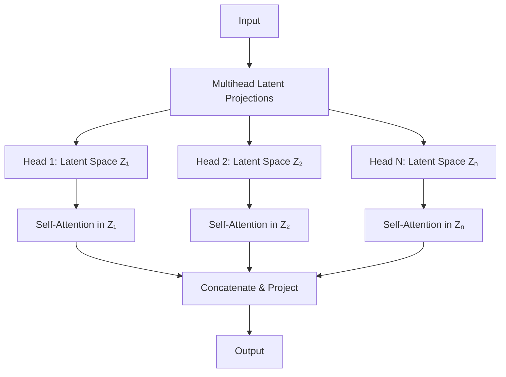
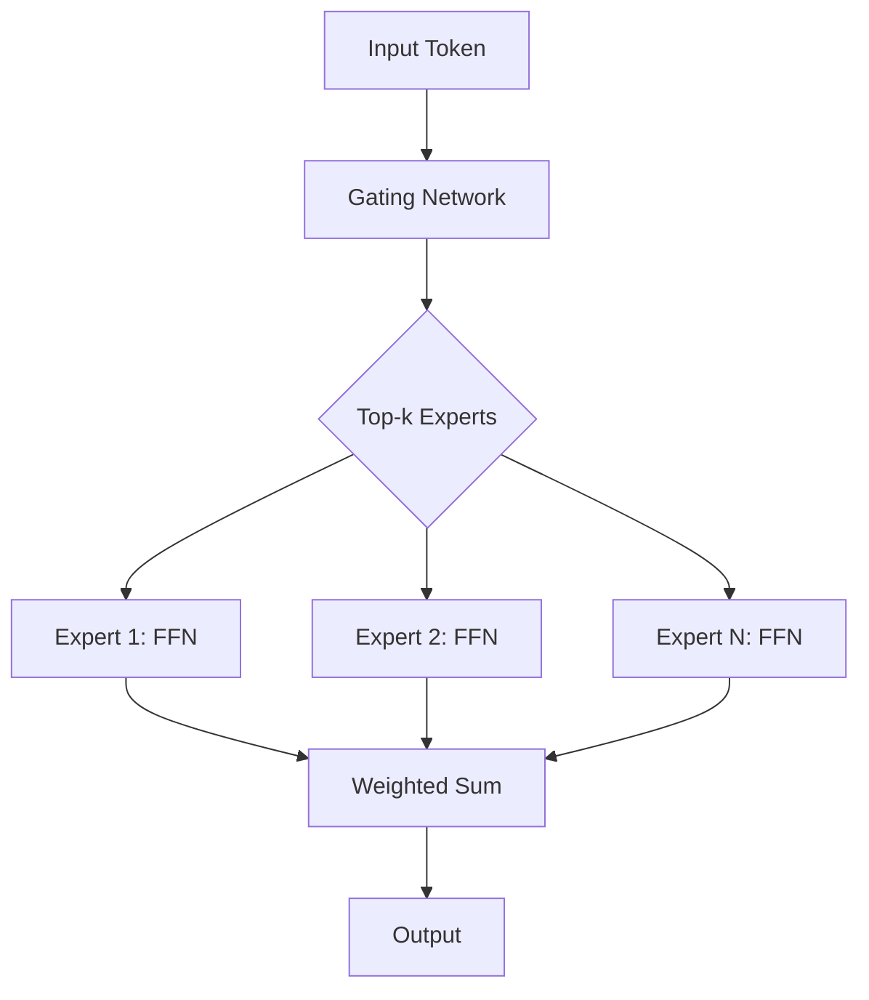
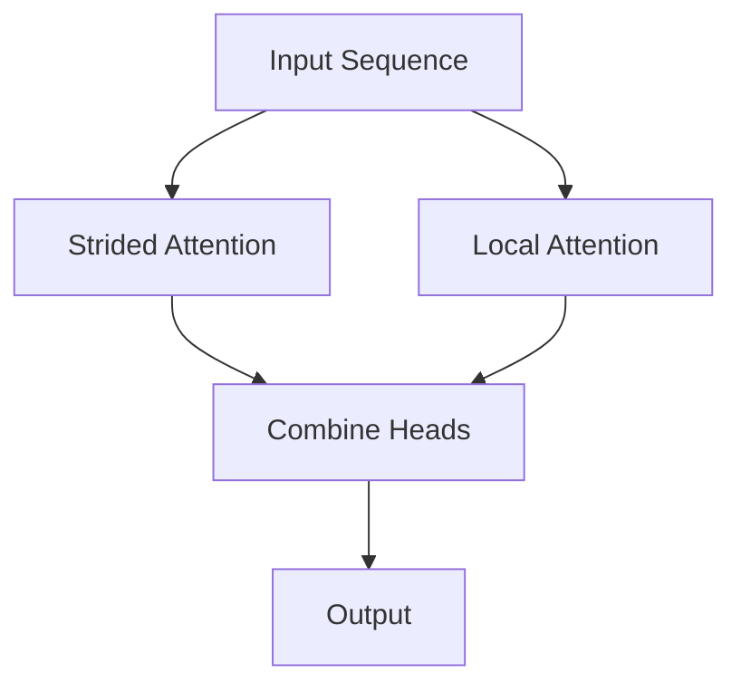
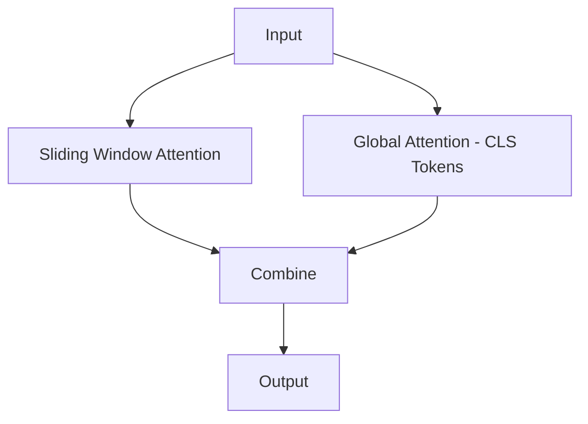
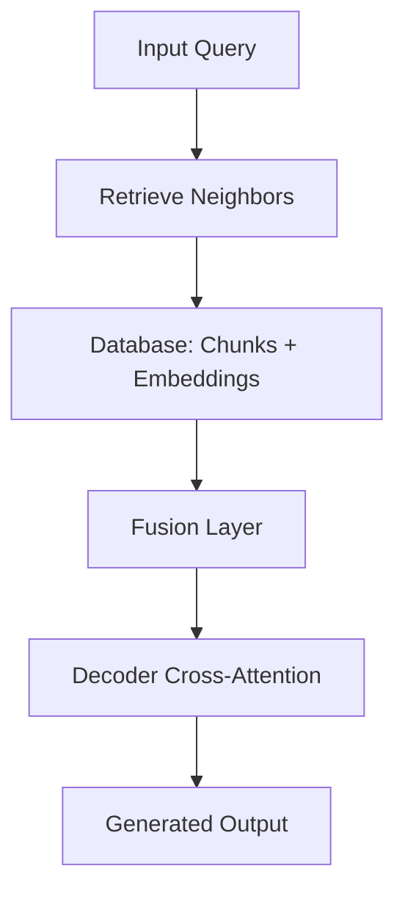
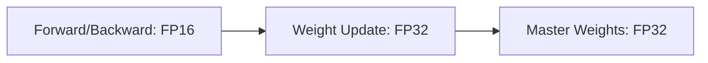

<!-- ---
layout: default
title: Models
parent: LLM
grand_parent: AI Research
math: katex
nav_order: 1
permalink: /docs/ai-research/llm/models
--- -->
# LLM Models

  

    Table of contents
  

  {: .text-delta }
- . TOC
{:toc}

## Architectures
### FFN (feed forward network)

### MoE (Mixture of Experts)

## Components
### Multi Latent Transformer

The Transformer architecture, introduced in ["Attention Is All You Need"](https://arxiv.org/abs/1706.03762) by Vaswani et al. (2017), revolutionized NLP by replacing recurrence with self-attention. Key components include:

```mermaid
graph LR
    A[Input Embedding] --> B[Positional Encoding]
    B --> C[Encoder Block]
    C --> D[Multi-Head Attention]
    D --> E[Feed-Forward Network]
    E --> F[Layer Normalization]
    F --> G[Encoder Output]
    G --> H[Decoder Block]
    H --> I[Masked Multi-Head Attention]
    I --> J[Cross-Attention Encoder-Decoder]
    J --> K[Feed-Forward Network]
    K --> L[Layer Normalization]
    L --> M[Decoder Output]
```

1. **Self-Attention Mechanism**:  
   Computes attention scores between all token pairs using:  
   $$
   \text{Attention}(Q, K, V) = \text{softmax}\left(\frac{QK^T}{\sqrt{d_k}}\right)V
   $$  
   where \( Q \), \( K \), and \( V \) are query, key, and value matrices.

2. **Multi-Head Attention**:  
   Splits input into multiple heads, applies attention in parallel, and concatenates outputs to capture diverse linguistic patterns.

3. **Positional Encoding**:  
   Adds sinusoidal or learned embeddings to inject positional information into token representations.

4. **Encoder-Decoder Architecture**:  
   - The encoder processes input into contextualized representations.  
   - The decoder generates outputs autoregressively.  
   - Variants like encoder-only (BERT) and decoder-only (GPT) dominate modern LLMs.

---

### Multihead Latent Transformer

An extension of the standard Transformer, the **Multihead Latent Transformer** introduces latent spaces within attention heads:

- **Latent Projections**:  
  Each head projects inputs into a distinct latent space via learnable transformations, enabling specialized feature extraction.
- **Dynamic Interaction**:  
  Latent variables allow heads to model complex dependencies (e.g., syntax vs. semantics) while maintaining parallel computation.
- **Applications**:  
  Effective in multimodal tasks where latent spaces can align text, images, or other modalities.

---

## Mixture of Experts (MoE)

MoE scales model capacity efficiently by activating subsets of "experts" per input:

1. **Architecture**:  
   - **Experts**: Multiple feed-forward networks (FFNs) per layer.  
   - **Gating Network**: Routes tokens to top-\( k \) experts (e.g., \( k=2 \)) using softmax probabilities.  

2. **Benefits**:  
   - **Sparse Activation**: Reduces computation vs. dense models (e.g., Switch Transformer achieves trillion-parameter scale).  
   - **Specialization**: Experts learn distinct skills (e.g., grammar, facts).  

3. **Challenges**:  
   - **Load Balancing**: Avoid underused experts via auxiliary loss terms.  
   - **Training Stability**: Requires careful initialization and gradient clipping.  

4. **Examples**:  
   - **GShard** (Google): MoE with cross-device expert sharding.  
   - **Mixtral** (Mistral): Open-source MoE model outperforming dense counterparts.  

---

## Sparse Attention Models

### Factorized Self-Attention

- **Sparse Transformers** (Child et al., 2019):  
  Use fixed patterns (e.g., strided or local attention) to reduce computation from \( O(n^2) \) to \( O(n\sqrt{n}) \).  
- **Blockwise Attention**: Processes sequences in chunks for memory efficiency.  

### Long-Range Adaptations

- **Longformer** (Beltagy et al., 2020): Combines local windowed attention with global tokens for document-level tasks.  
- **BigBird**: Integrates random, windowed, and global attention to handle sequences up to 8K tokens.  

---

## Retrieval-Augmented Models

### Dense Retrieval

- **RETRO** (Borgeaud et al., 2022): Retrieves nearest neighbors from a corpus using dense embeddings, fusing them into decoder layers.  

- **DPR** (Karpukhin et al., 2020): Dual-encoder architecture for open-domain QA.  

### Fusion Mechanisms

- **Fusion-in-Decoder** (Izacard & Grave, 2021): Concatenates retrieved passages with input for cross-attention in the decoder.  

---

## Efficient Training Techniques

### Gradient Checkpointing

Saves memory by recomputing activations during backward passes instead of storing them.  

### Mixed Precision Training

Uses 16-bit floats for faster computation, with master weights in 32-bit for stability.  

---

<!-- 

Expand for Additional Topics (e.g., Adaptive Computation, Energy-Based Models)

 -->

