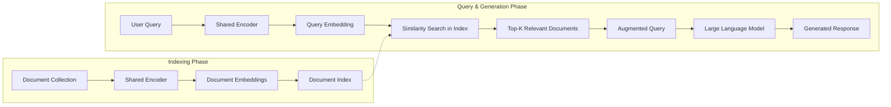

# LLM Utilizations

Utilizations that ensure robustness in LLM predictions while merely deforming base model architecture.


<details open markdown="block">
  <summary>
    Table of contents
  </summary>
  {: .text-delta }
- . TOC
{:toc}
</details>

## RAG


In the adevent of LLM, many AI researchers try to engage pretrained LLM with their own data. This is because training LLM from scratch is costly and hard. 
In this background, one of the powerful engaging method is RAG (Retrieval-augmented generation) [[1](#lewis-et-al)]. The concept of RAG is quite simple but powerful.   
The following diagram is an architecture of LLM service with RAG, drawn by myself, which could be a little bit different from the original paper[[1](#lewis-et-al)].



In batch process, we can save our constarints (contexts, documents or policies) with embedding models, (vectorization / encoding / graph embedding and so on). Once we have a language query from user, we simply encode the query with the same embedding models, and findout the document near the vector. Finally, we simply put found documents and original user's query to LLM, we can get generated output with our intended contexts. 

### Basic Implementation


```bash
.
├── lib
│   ├── llm
│   └── OpenBLAS
├── scripts
│   └── add_document.py
├── src
│   ├── core.py
│   ├── embedding.py
│   └── utils.py
├── vector_store
│   └── .gitkeep
├── download_model.sh
├── easy_rag.py
├── vector_index.py
└── README.md
```

For detailed installation and usage, please visit my git repository.

 > visit : [easy_rag](https://github.com/Sangdo-Han/public-studies/tree/master/llm/rag)

### Output
<p align="center">
  
</p>

In this example, I put this blog-post into the vector-store. Therefore, as you might notice in the above example, this chat-bot answers depend on this page and the page navigations.
> Focus on the answer (`The concept of RAG is simple but powerful`), which is derived in the first paragraph of this post (`The concept of RAG is quite simple but powerful`).   


## References
<span id="lewis-et-al">[1]</span> Lewis, P., Perez, E., Piktus, A., Petroni, F., Karpukhin, V., Goyal, N., ... & Kiela, D. (2020). Retrieval-augmented generation for knowledge-intensive nlp tasks. Advances in Neural Information Processing Systems, 33, 9459-9474.
